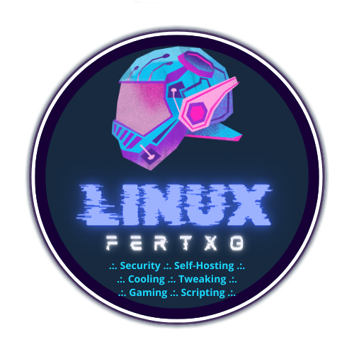

<h1>
    

        
         
        Mis servicios Docker para Homelab
        <h2>

            Una selección comentada de contenedores que espero sirva de inspiración para vuestros proyectos
        </h2>
    

</h1>

<!--  -->

### Estructura del repositorio:

* Cada servicio tiene su propia carpeta y `README.md`, con ejemplos y archivos auxiliares así como comentarios donde he pensado que era relevante. Echa un vistazo a cada uno para entender mejor cómo funcionan.
* Se pueden hacer funcionar tanto desde CLI como importándolos en Portainer, Dockge...
* Aunque se pueden desplegar en cualquier momento, los siguientes contenedores es interesante hacerlo en este orden por tener dependencias unos de otros:

      1. Socket Proxy
      2. Traefik
      3. Authelia
      4. Nextcloud
      5. Crowdsec
      6. MariaDB (Varios contenedores dependen de ella)
      7. Otros contenedores con etiquetas para Traefik

### ¿Qué puedo aprender aquí?

Todo los servicios son completamente funcionales, pero soy consciente de que existen distintas (infinitas) formas de abordar cada caso. Aunque algunos de ellos podrían ser mejorables he intentado que cada uno tenga al menos una técnica nueva que podremos aplicar en otros contextos.

* En Socket Proxy veremos la **estructura general de un docker-compose**:
  * Servicios, redes, volúmenes y variables de entorno.
  * La inclusión de `privileged` para crear contenedores con privilegios sobre la máquina host.
* En Traefik veremos el **uso de etiquetas** y además:
  * La correlación entre archivos dentro del contenedor y su enlace en el sistema de archivos de la máquina host.
  * Crear redes externas al compose.
  * Crear Tokens en Cloudflare.
* En Authelia introduciremos el **uso de secretos** como medida de seguridad para nuestos datos sensibles.
  * También veremos cómo generar contraseñas fuertes en un sistema Linux.
  * Aprenderemos a ejecutar comandos dentro de un contenedor que todavía no ha sido levantado.
* En Nextcloud veremos un **compose multiservicio**:
  * Un contenedor para la aplicación, otro para la base de datos relacional y otro para la base de datos en memoria.
  * El uso de `command` como medio de levantar un contenedor siempre con unas mismas condiciones iniciales.
* En Dashy crearemos un chequeo de salud para el contenedor.
* En Crowdsec cómo **ejecutar comandos en un contenedor**:
  * Desde fuera en nuestro shell y desde dentro con el modo interactivo.
  * Veremos también el uso de _plugins_ en Traefik.
* En OPNdash cómo crear **volúmenes prefijados** en Docker.
* En Proxmox Backup Server cómo **crear un volúmen prefijado** pero que el contenedor lo vea **como dispositivo físico de almacenamiento**.
* Y otras cosas que se me irán ocurriendo por el camino...

### Tareas pendientes:
- [x] _Docker Socket Proxy_
- [x] _Træfik_
- [x] _Authelia_
- [x] _Nextcloud_
- [x] _Crowdsec_
- [x] _Dashy_
- [ ] Atuin
- [ ] Cloudflare DDNS
- [ ] jDownloader
- [ ] MariaDB
- [ ] OPNSense Dashboard
- [ ] Proxmox Backup Server
- [ ] Proxmox Dashboard

### Creadores de contenido que me han servido de inspiración y material en el que me he apoyado

Hoy en día casi todo está inventado. Cada caso es particular y hay que adaptar toda la información que hay en la red a nuestras necesidades. Todo ésto no habría empezado si no fuera por los numerosos expertos que tenemos la suerte de tener hoy en día en la red. Por lo tanto,

## Gracias infinitas a:

* **Timothy Stewart (Techno Tim)**
    * __[Página web](https://technotim.live)__
    * __[YouTube](https://www.youtube.com/@technotim)__
* **Jay LaCroix (Learn Linux TV)**
    * __[Página web](https://www.learnlinux.tv)__
    * __[YouTube](https://www.youtube.com/@LearnLinuxTV)__
* **Carlos (Computadoras y Sensores)**
    * __[YouTube](https://www.youtube.com/@ComputadorasySensores)__
    * __[Github](https://github.com/computadorasysensores)__
* **Anand (Smart Home Beginner)**
    * __[Página web](https://www.smarthomebeginner.com)__
    * __[YouTube](https://www.youtube.com/@AnandsLab)__
* **Christopher Barnatt (Explaining Computers)**
    * __[Página web](https://explainingcomputers.com)__
    * __[YouTube](https://www.youtube.com/@christopherbarnatt)__
* **La Biblia de Linux**
    * __[Arch Linux Wiki (btw)](https://wiki.archlinux.org/title/Main_page)__ 😎
* **Documentación online**
    * **[Docker](https://docs.docker.com)**
    * **[Traefik](https://doc.traefik.io/traefik/)**
    * **[Authelia](https://www.authelia.com/overview/prologue/introduction/)**

**A todos y cada uno de los programadores cuyos contenedores he utilizado en mis proyectos. Hay una referencia a su trabajo dentro de cada `README.md`. Gracias por vuestro esfuerzo y a vuestra voluntad de compartir.**
