<h1>
  <p align="center" width="100%">
    
    </br>
      Authelia
  </p>
</h1>
    
<h2>
  <p align="center" width="100%">
      Authelia es un servidor de autenticación de doble factor (2FA) e inicio de sesión único (SSO) dedicado a la seguridad de aplicaciones y usuarios.  
  </p> 
</h2>

<h3> 
  <p align="left" width="100%">
    Basado en la imagen de <a href="https://www.authelia.com">Authelia</a>: <a href="https://github.com/authelia/authelia/pkgs/container/authelia">authelia</a>
  </p>
</h3>

<!-- [](README.md) -->

<h3>
  Contenido:
</h3>

- [Estructura](#estructura)
- [Descripción](#descripción)
  - [*Configuración de Authelia*](#configuración-de-authelia)
  - [*Configuración de usuarios*](#configuración-de-usuarios)
  - [*Otras observaciones*](#otras-observaciones)
  - [*Variables de entorno*](#variables-de-entorno)
  - [*Antes de empezar*](#antes-de-empezar)
- [Primer arranque y registro de dispositivos](#primer-arranque-y-registro-de-dispositivos)

## Estructura

    authelia/
      ├─ docker-compose.yml               → archivo docker
      ├─ .env                             → variables de entorno
      ├─ config/
      │    ├─ configuration.yml           → configuración de Authelia
      │    ├─ users_database.yml          → base de datos de usuarios
      │    ├─ authelia.log                → registro, se genera al iniciar
      │    ├─ db.sqlite3                  → base de datos SQLite, se genera al iniciar
      │    ├─ notification.txt            → mensajes para verificar identidad, se genera al primer uso
      │    └─ secrets/                    → contraseñas y claves
      │         ├─ jwt_secret
      │         ├─ session_secret
      │         ├─ storage_encryption_key
      │         └─ authelia_session_redis_password
      └─ redis/                           → datos del servidor redis

## Descripción

La configuración de Authelia puede llegar a ser muy complicada. Aquí se ha optado por una forma sencilla que resulta válida para uno o unos pocos usuarios. Para otras opciones más complejas nos tendremos que remitir a la [documentación oficial de Authelia](https://www.authelia.com/configuration/prologue/introduction/).

Los archivos `docker-compose.yml` y `.env` como siempre no necesitan presentación, son los archivos que contienen todas las instrucciones y variables para crear el contenedor de Authelia.

### *Configuración de Authelia*

El archivo `configuration.yml` contiene la toda la configuración de Authelia. Aunque hay comentarios en cada línea importante, aquí se presentan los puntos más relevantes:

  * El bloque `server:` ha sido actualizado y ya no sirven las claves `host:` y `port:`. En su lugar, se utiliza la clave `address:` en la forma **`[<scheme>://][hostname]:<port>[/<path>]`** . Por ejemplo, `tcp://:9091`. Se ha optado por dejar las claves viejas comentadas por si os encontráis con otros tutoriales no actualizados.
  * El bloque `authentication_backend:` define qué tipo de base de datos de usuario y el algoritmo de encriptación utilizados.
  * El bloque `access_control:` define las reglas de acceso.
  * El bloque `session:` define la configuración de los tiempos de vida de sesión, así como la dirección del servidor redis los que mantendrá en memoria.
  * El bloque `regulation:` define cómo se manejan los intentos fallidos.
  * El bloque `storage:` define cómo se guardan los datos.
  * El bloque `notifier:` define de qué manera nos comunicaremos con los usuarios para verificar su identidad.

La subcarpeta `secrets` contiene las claves y contraseñas que se utilizarán en la configuración de Authelia. Cada archivo contendrá una clave que según la documentación oficial...

> Se **recomienda encarecidamente** que sea una cadena alfanumérica aleatoria con 64 o más caracteres.

Tenemos que generar una para cada archivo, es decir, cuatro en total. 
¿Cómo las generamos? Tenemos muchas opciones desde la shell de Linux:

```bash
# Con openssl (disponible por defecto en la mayoría de distribuciones):
  openssl rand -hex 64
# Con pwgen (necesita instalación):
  pwgen -s 64
# Mediante Docker y el propio contenedor de Authelia (no es necesario que esté en servicio todavía):
  docker run --rm authelia/authelia:latest authelia crypto rand --length 64 --charset alphanumeric
# Sin ningún tipo de herramienta instalada:
  date +%s | sha256sum | base64 | head -c 64 ; echo
```
>

O con vuestra herramienta on-line favorita: [IT-Tools](https://it-tools.tech/token-generator), [Generate Random](https://generate-random.org/api-token-generator)...

### *Configuración de usuarios*

El archivo `users_database.yml` bajo el bloque `users:` contiene a su vez un bloque por cada usuario que configuremos:

```yaml
users:
  pepito:
    displayname: "Pepito Pérez"
    password: "" → Hay un gran vacío aquí, pero no os preocupéis, lo rellenaremos en el siguiente paso. 😉
    email: pepito@ejemplo.com
    groups:
      - admins
      - dev
  # usuario2:
    # etc...  
```
</br>

Efectivamente, **la contraseña está vacía**. Para generar una acorde al algoritmo que hemos especificado en el archivo `configuration.yml`, podemos utilizar el comando `authelia crypto hash`. 

*¡Pero todavía no tenemos Authelia funcionando!* os oigo exclamar... Tranquilos, lo que haremos será pedir ejecutarlo al contenedor. Al ser la primera vez que le pedimos a Docker hacer algo con Authelia, lo primero que hará será descargar la imagen (eso que llevamos adelantado para luego), por lo que tendremos que esperar un rato para obtener el resultado. Aquí el comando:

```bash
docker run authelia/authelia:latest authelia crypto hash generate argon2 --password PASSWORD
```
>

Sustituir PASSWORD por nuestra contraseña y copiar el resultado desde el primer símbolo `$` hasta el final dentro del bloque `password:`.

> **Truco**: Si escribimos un espacio antes de todo el comando le estaremos diciendo a la Shell que no almacene la línea en el historial.*** 😎

### *Otras observaciones*

Dentro de la carpeta `redis/` se generaran archivos que en realidad no tenemos que hacer nada con ellos. Se puede generar un volumen de docker en lugar de un bind mount.

El servicio se apoya en Traefik, aunque es adaptable a otros proxies inversos.

### *Variables de entorno*

* `PUID` y `PGID` son los identificadores de usuario y grupo en formato numérico (ejecutar `id` para conocerlos)
* `TZ` es la zona horaria en formato `Continente/Ciudad`. [Listado de zonas](https://www.joda.org/joda-time/timezones.html)
* `DOCKERDIR` es el directorio que contiene todos los servicios de Docker.
* `DOMAINNAME` es el nombre de nuestro dominio.

### *Antes de empezar*

Crear la estructura arriba indicada. Es interesante que tanto la carpeta `secrets` como los archivos en su interior tengan permisos 600 (rw- --- ---).

Asegurarse de que tanto los archivos de la carpeta `secrets` como la contraseña de nuestro usuario en el archivo `users_database.yml` tengan contenido.

La red `proxy` debe estar presente antes de arrancar el compose.

El contenedor `traefik` debe estar funcionando previamente.

## Primer arranque y registro de dispositivos

```bash
docker compose up -d      → arrancamos Authelia en segundo plano

docker logs authelia -f   → examinamos los registros para ver si hay algún problema (CTRL+c para salir)
```
>

Tras revisar en el log que todo va bien, iremos a la dirección que hayamos configurado en `docker-compose.yml` (la línea auth.$DOMAINNAME) y seguiremos los siguientes pasos:

</br>

  <p align="center" width="100%">
    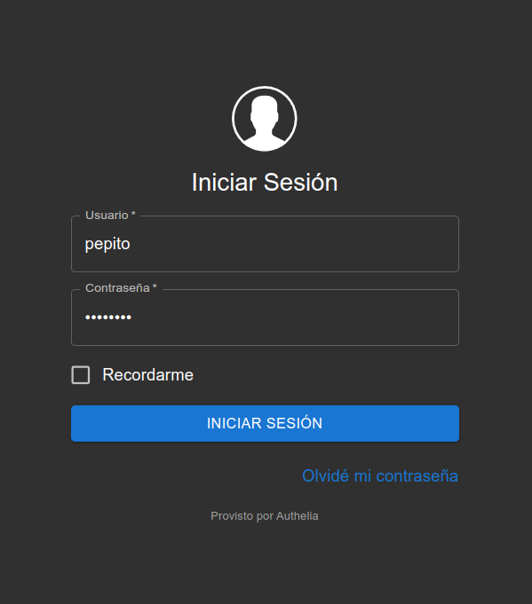
    </br>Introducimos nuestras credenciales
  </p>

</br>

  <p align="center" width="100%">
    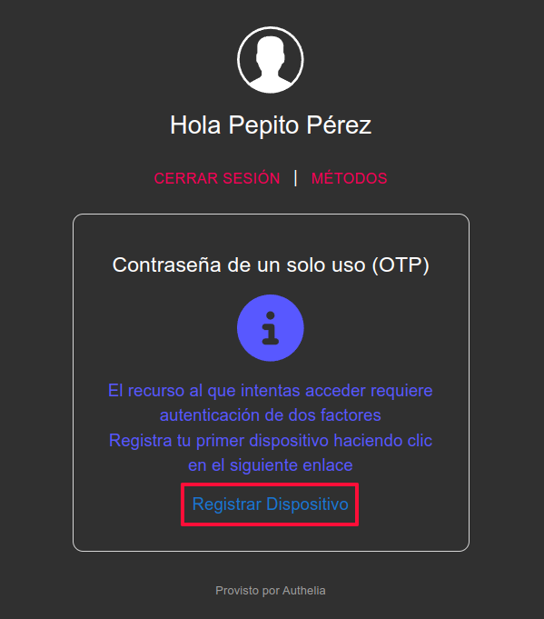
    </br>Pinchamos en Registar Dispositivo
  </p>

</br>

  <p align="center" width="100%">
    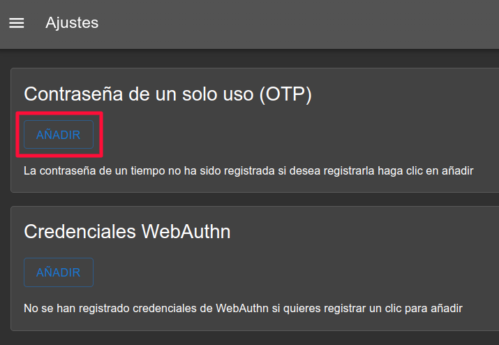
    </br>Primero registraremos una contraseña de un solo uso
  </p>

</br>

  <p align="center" width="100%">
    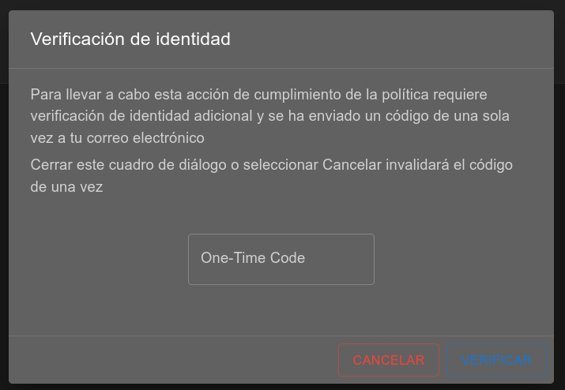
    </br>Nos advierte que nos llegará un correo... que no llegará porque no tenemos un servidor de correo configurado. Acudimos al archivo `notification.txt` de la carpeta `config/`
  </p>

</br>

  <p align="center" width="100%">
    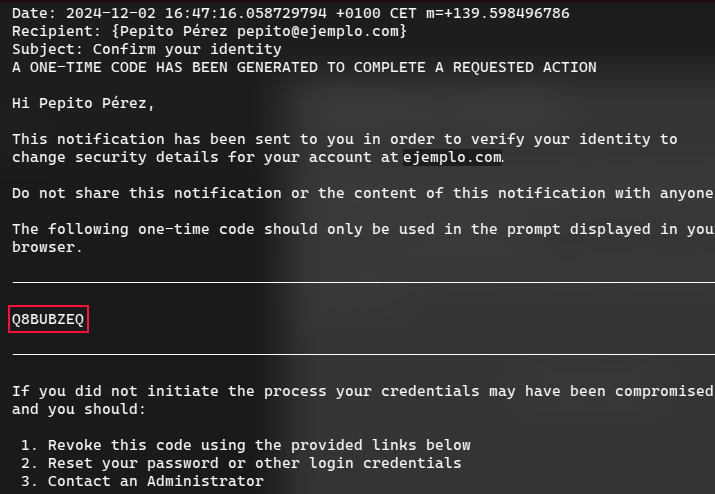
    </br>Copiamos el código aleatorio y lo introducimos en el diálogo anterior
  </p>

</br>

  <p align="center" width="100%">
    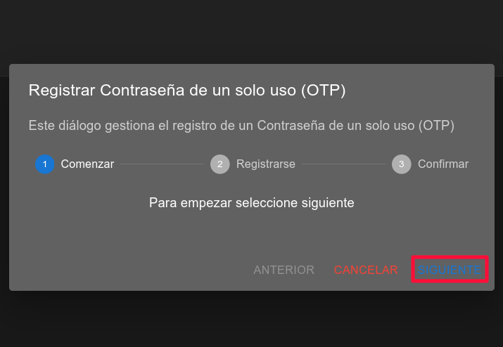
    </br>Pulsamos en SIGUIENTE
  </p>

</br>

  <p align="center" width="100%">
    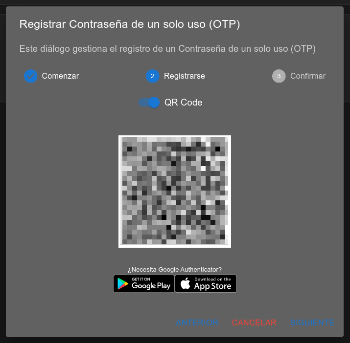
    </br>Escaneamos el código QR con nuestra aplicación favorita. En mi caso es <a href="https://play.google.com/store/apps/details?id=com.authy.authy&hl=es&pli=1">Authy para Android</a>
  </p>

</br>

  <p align="center" width="100%">
    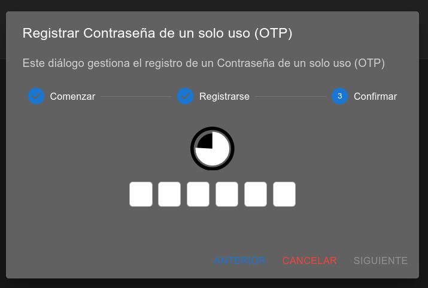
    </br>Introducimos el código generado
  </p>

</br>

  <p align="center" width="100%">
    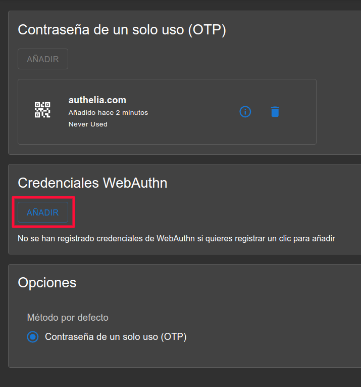
    </br>Ya tenemos configurado un segundo factor, ahora vamos a probar con un dispositivo físico pulsando AÑADIR en Credenciales WebAuthn
  </p>

</br>

  <p align="center" width="100%">
    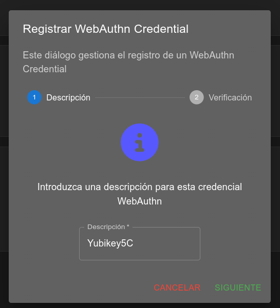
    </br>En éste caso daremos de alta una Yubikey 5C
  </p>

</br>

  <p align="center" width="100%">
    
    </br>Introducimos nuestro PIN
  </p>

</br>

  <p align="center" width="100%">
    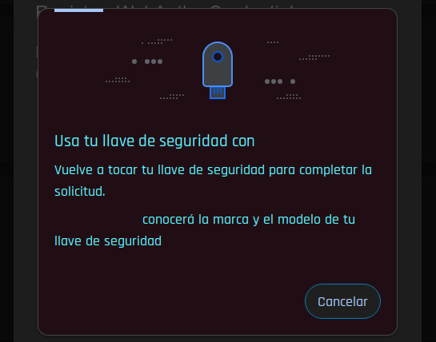
    </br>Tocamos el botón físico de la Yubikey
  </p>

</br>

  <p align="center" width="100%">
    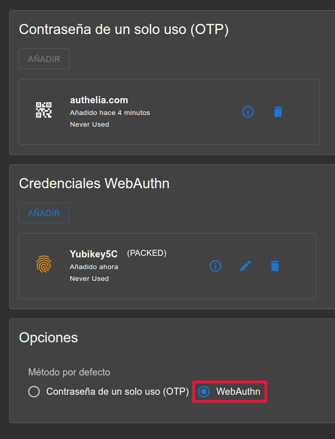
    </br>Y por último podremos elegir el método que se nos presentará por defecto. Siempre podremos decir cual en el momento en que nos lo solicite, esto es tan solo una preferencia.
  </p>

</br>

<h3>
¡Listo! Ya podemos acceder a nuestras aplicaciones con autenticación de doble factor.
</h3>